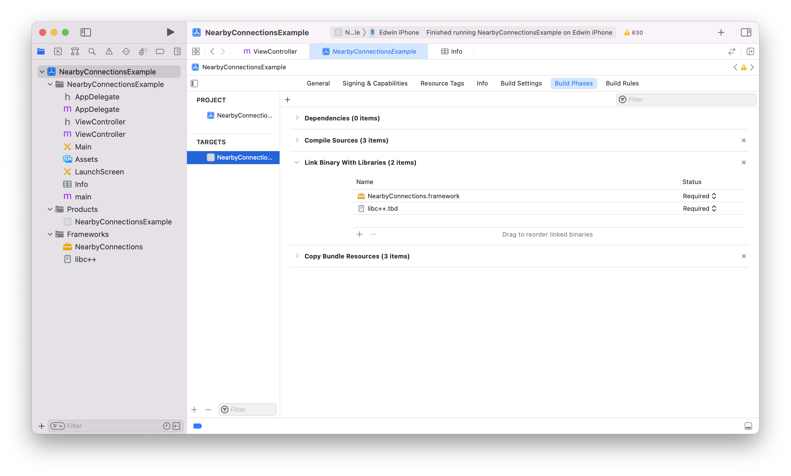
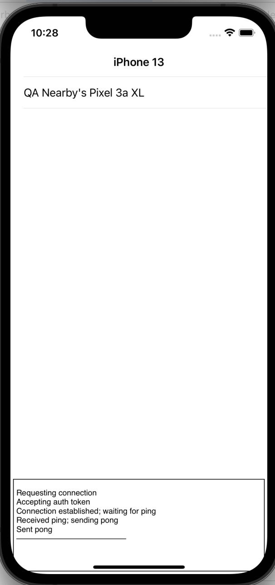

# Nearby Connections Sample App for iOS

This is a sample app for third party developers using the Nearby Connections
library. On startup, it advertises and discovers. Discovered advertisers are
added to the list in the UI. When the user taps on an advertiser in the list,
the discoverer requests a connection with it. When the connection is
established, the advertiser sends a "ping" payload to the discoverer, which
sends "pong" payload back to the advertiser. The connection is then closed.

## Setup

1.Get the NearbyConnections_framework.zip from https://github.com/google/nearby/releases/tag/v0.0.1-ios, unzip it,
and put your unzipped folder under your project folder. The directory structure
looks like:

```
/NearbyConnectionsExample
  /NearbyConnectionsExample
  NearbyConnectionsExample.xcodeproj
  README.md
  /NearbyConnections.framework
```

2.Import NearbyConnections.framework

- In Xcode, click the NearbyConnectionsExample in the left pane. And click the one in TARGETS-NearbyConnectionsExample at the left of right pane and the Build Phases at the right.
- See the **Link Binary With Libraries**, and press **+** to import the file - **libc++.tbd**.
- In Add **Other…**, import the NearbyConnections.framework folder which was unzipped.



3.Update info.plist:

- add **NSLocalNetworkUsageDescription** key with a description of your usage of Nearby Connections.
- add **NSBonjourServices** key.
  for NSBonjourServices key, add the bonjour type name: `_54167B379724._tcp`

> **54167B379724** is the 6 byte hash of service id **com.google.NearbyConnectionsExample**

```
// NearbyConnectionsExample/info.plist
...
<key>NSLocalNetworkUsageDescription</key>
<string>Exchange data with nearby devices running the NearbyConnectionsExmaple app.</string>
<key>NSBonjourServices</key>
<array>
  <string>_54167B379724._tcp</string>
</array>
...
```


4.Add service id and import `<NearbyConnections/NearbyConnections.h>` in your main view controller.

```
// NearbyConnectionsExample/ViewController.m

static NSString *kServiceId = @"com.google.NearbyConnectionsExample";

#import <NearbyConnections/NearbyConnections.h>
```

## Code Snippets
Note: All of the callbacks in this library use blocks rather than delegates. Be careful to avoid retain cycles in your block implementations. See the [Apple documentation](https://developer.apple.com/library/archive/documentation/Cocoa/Conceptual/MemoryMgmt/Articles/mmPractical.html#//apple_ref/doc/uid/TP40004447-SW1) describing how to avoid retain cycles.

Here is the skeleton code for an advertiser:

```objc
_advertiser = [GNCAdvertiser
     advertiserWithEndpointInfo:endpointInfo
                      serviceId:myServiceId
                       strategy:GNCStrategyCluster
    connectionInitiationHandler:^(GNCEndpointId endpointId,
                                  id<GNCAdvertiserConnectionInfo> connectionInfo,
                                  GNCConnectionResponseHandler responseHandler) {
  // Decide whether to accept or reject the connection.  The following code would normally
  // exist in the callback for an alert, for instance.
  if (/* user rejected */) {
    responseHandler(GNCConnectionResponseReject);  // the user rejected the invitation
  } else {
    responseHandler(GNCConnectionResponseAccept);  // the user accepted the invitation

    // Return connection result handlers, one of which is called depending on
    // whether a successful connection was made.
    return [GNCConnectionResultHandlers successHandler:^(id<GNCConnection> connection) {
      // A successful connection was made. Save the connection somewhere, which can
      // be used to send payloads to the remote endpoint.

      // Return the incoming payload and disconnect handlers.
      return [GNCConnectionHandlers handlersWithBuilder:^(GNCConnectionHandlers *handlers) {
        // Optionally set the Bytes payload handler.
        handlers.bytesPayloadHandler = ^(GNCBytesPayload *payload) {
          // Process the payload received from the remote endpoint.
        };

        // Optionally set the Stream payload handler.
        handlers.streamPayloadHandler = ^(GNCStreamPayload *payload, NSProgress *progress) {
          // Receipt of a Stream payload has started.  Input can be read from the payload’s
          // NSInputStream, and progress/cancellation is handled via the NSProgress object.
          return ^(GNCPayloadResult result) {
            if (result == GNCPayloadResultSuccess) {
              // The payload has been successfully received.
            }
          };
        };

        // Optionally set the disconnected handler.
        handlers.disconnectedHandler = ^(GNCDisconnectedReason reason) {
          // The connection was severed by either endpoint or lost.
        };
    }
    failureHandler:^(GNCConnectionFailure result) {
      // Failed to make the connection.
    }]);
  }
}];
```

Here is the skeleton code for a discoverer:

```objc
_discoverer =
    [GNCDiscoverer discovererWithServiceId:myServiceId
                                  strategy:GNCStrategyCluster
                      endpointFoundHandler:^(GNCEndpointId endpointId,
                                             id<GNCDiscoveredEndpointInfo> discEndpointInfo) {
  // An endpoint was found.  Typically you would add it to a list of nearby endpoints
  // displayed in a UITableView, for instance.

  // The following code shows how to request a connection with the endpoint.  This code
  // would normally exist in the -didSelectRowAtIndexPath: of UITableViewDelegate.
  if (/* user wants to request a connection */) {
    requestHandler(myName,
        // This block is called once an authentication string is generated between the endpoints.
        ^(id<GNCDiscovererConnectionInfo> discConnInfo, GNCConnectionResponseHandler responseHandler) {
          // Ask the user to confirm the authentication string.
          UIAlertController *alert = [UIAlertController alertControllerWithTitle:@"Accept auth?" ...];
          [alert addAction:[UIAlertAction actionWithTitle:@"OK"
                                                    style:UIAlertActionStyleDefault
                                                  handler:^(UIAlertAction *action) {
            responseHandler(GNCConnectionResponseAccept);
          }]];
          [alert addAction:[UIAlertAction actionWithTitle:@"Cancel"
                                                    style:UIAlertActionStyleDefault
                                                  handler:^(UIAlertAction *action) {
            responseHandler(GNCConnectionResponseReject);
          }]];
          [self presentViewController:alert animated:YES completion:^{}];

          // Return a block that's called if the connection was successful.
          return ^(id<GNCConnection> connection) {
            // A successful connection was made. Save the connection somewhere, which can
            // be used to send payloads to the remote endpoint.

            // Return incoming data handlers as in the advertiser example above.
            return [GNCConnectionHandlers handlersWithBuilder:^(GNCConnectionHandlers *handlers) {
              // Set up payload and disconnect handlers here as in the advertiser example above.
            }];
          };
        },
        // This block is called if the connection failed for any reason.
        ^(GNCConnectionFailure result) {
          // Typically an alert would be shown here explaining why the connection failed.
        });
  }

  // Return the endpoint-lost handler, which is called when the endpoint goes out of range
  // or stops advertising.
  return ^{
    // The endpoint disappeared.
  };
}];
```

Here is an example of how to send a Bytes payload. The returned NSProgress object can be passed to UIProgressView to display a progress bar.

```objc
NSProgress *progress = [connection
    sendBytesPayload:[GNCBytesPayload payloadWithBytes:someData]
          completion:^(GNCPayloadResult result) {
            // Check status to see if it was successfully sent.
          }];
```

## Build and run



If you meet the following error in the debug panel of Xcode, you likely need to set up the keys listed in step 3 **Update info.plist**, as well as the service type.

```
1970-01-01 00:00:00.000 NearbyConnectionsExample[1383/0x16d87b000] [lvl=1] -[GNCMBonjourService netService:didNotPublish:] Error publishing: service: <NSNetService 0x283a18920> local _307BEAB11028._tcp. IjFQWEUwe-oAAA 51898, errorDic: {
    NSNetServicesErrorCode = "-72008";
    NSNetServicesErrorDomain = 10;
}
```
---
NOTE: The iOS simulator is unstable when advertising. We recommend using a real iOS device.
