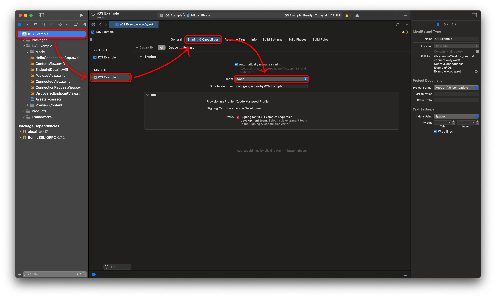
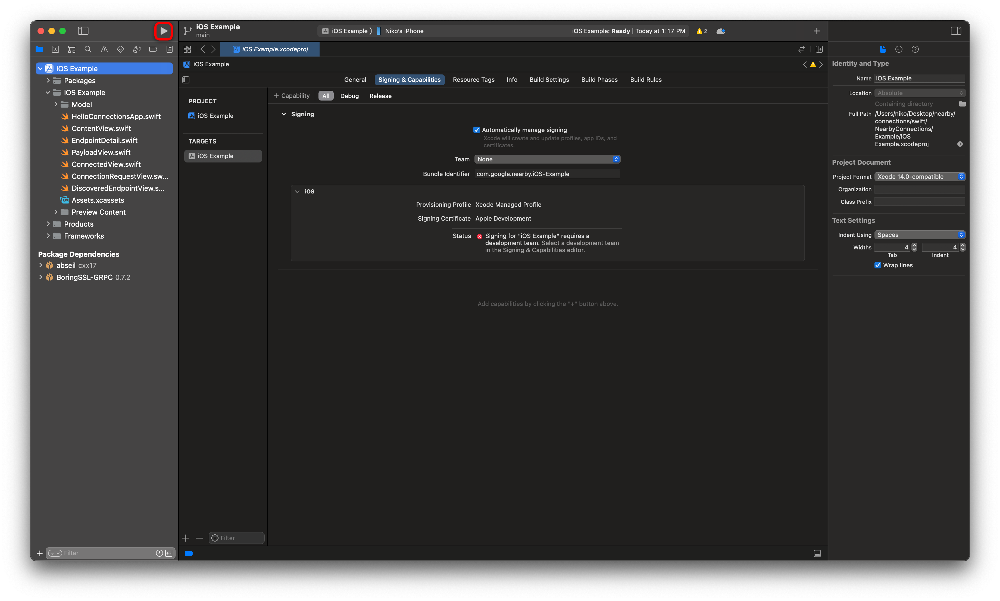

# Nearby Connections iOS Example

A sample app for using Nearby Connections in iOS.

## Setup
1. Clone the Nearby repo with all submodules by running the following command:

   ```bash
   git clone --recurse-submodules https://github.com/google/nearby.git
   ```

2. Open the sample app in Xcode:

   ```bash
   open nearby/connections/swift/NearbyConnections/Example/iOS\ Example.xcodeproj
   ```

3. Choose a development team by navigating to `iOS Example` > `iOS Example` under "Targets" > `Signing & Capabilities` and then choosing your team from the "team" drop-down:

   


## Run the App

The app can be run pressing the "run" button or the <kbd>Command</kbd> + <kbd>R</kbd> keyboard shortcut:


