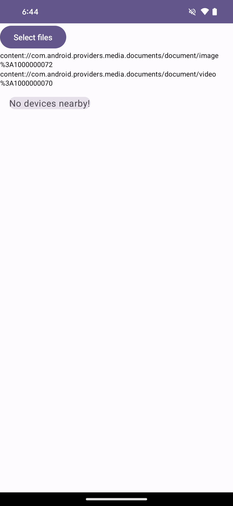

# Nearby Share sample app

This app is a demonstration of how to bind to and use the Nearby Share slice.

## Build instructions
From the root of the repository:
```
$ cd sharing/android/example
$ ./gradlew build
```

## Key callouts
MainViewModel - contains the business logic for processing and binding to the slice, as well as the lifecycle of the slice.

MainActivity - hosts the `MainView` composable and provides the intent to fill in the slice's PendingIntent action with, providing the data to send via Nearby Share.

## Screenshots



